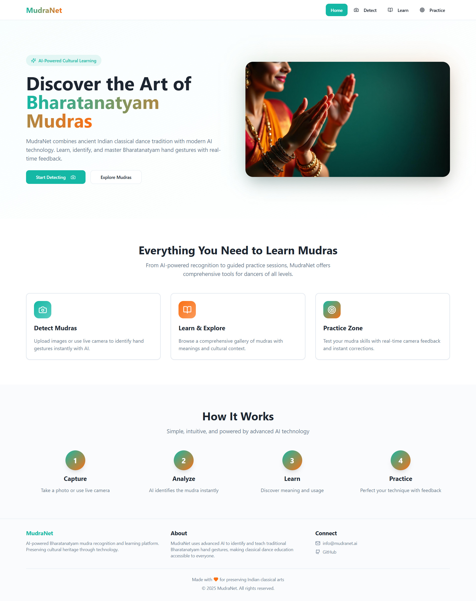

# 🎯 Smart India Hackathon 2025 — PS ID: 25157

---

# 🎭 MudraNet  
**AI-Powered Bharatanatyam Mudra Recognition & Learning Platform**

<video src="MudraNet/AI_Meets_Art_MudraNet_Video.mp4" width="100%" controls></video>

---

## 🪷 Overview
**MudraNet** bridges the gap between tradition and technology by using AI to identify, learn, and practice Bharatanatyam hand gestures (mudras).  
It empowers dancers, students, and enthusiasts to explore the beauty of Indian classical dance through intelligent recognition and interactive learning.

Developed as part of **Smart India Hackathon 2025**, MudraNet focuses on preserving India’s intangible cultural heritage through advanced computer vision and machine learning techniques.

---

## ✨ Features

### 🔍 Mudra Detection
- Upload an image or use your live camera to detect Bharatanatyam hand gestures.
- Get instant AI predictions with confidence levels.
- Learn the meaning, symbolism, and cultural context of each mudra.

### 📚 Learn Section
- Explore a curated gallery of **Asamyukta** and **Samyukta Hasta** mudras.
- View high-quality images, Sanskrit names, and real-world representations.
- Search mudras by name, meaning, or description.

### 🎯 Practice Zone
- Activate your webcam and perform mudras for real-time feedback.
- Track **accuracy, attempts, and progress** visually.
- Improve your form with AI-guided suggestions.

---

## 🧠 How It Works

| Step | Description |
|------|--------------|
| 1️⃣ Capture | Take a photo or use the camera to input your mudra. |
| 2️⃣ Analyze | The AI model identifies the mudra using computer vision. |
| 3️⃣ Learn | Explore the meaning, usage, and name of the identified gesture. |
| 4️⃣ Practice | Receive instant feedback to refine your technique. |

---

## 🖼️ Screenshots

### 🏠 Home Page

### 🔍 Mudra Detection

### 📖 Learn Mudras

### 🧘 Practice Zone

---

## ⚙️ Tech Stack
| Category | Technologies |
|-----------|---------------|
| **Frontend** | React.js, TailwindCSS |
| **Backend** | Flask |
| **AI/ML** | TensorFlow, MediaPipe, OpenCV |

---

## 🌍 Impact
MudraNet aims to preserve India’s intangible cultural heritage by:
- Making Bharatanatyam education accessible to everyone.
- Helping learners receive instant feedback using AI.
- Digitally documenting and archiving traditional dance forms.

---

## 👥 Team
**Project by:** Innoverse2.0_  
**Developed for:** Smart India Hackathon 2025 (PS ID: 25157)  
**Organization:** AICTE — Indian Knowledge Systems (IKS)

---

> “Preserving Indian classical arts through the lens of artificial intelligence.”
